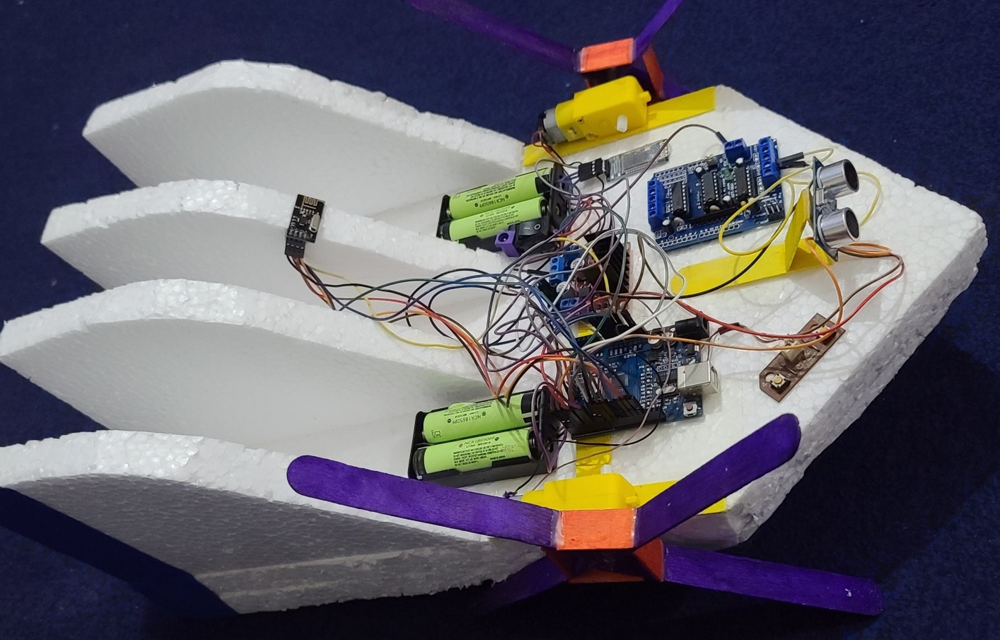

# 🌊 TideSync – Voice-Controlled Smart Aquatic Robot



---

## 📄 Abstract

TideSync is a voice-controlled aquatic robot that uses a **multi-microcontroller architecture** consisting of an **ESP8266**, **Arduino Uno**, and **Arduino Nano**. The boat supports **Wi-Fi**, **Bluetooth**, and **radio** communication modes and includes an **ultrasonic echo locator** for real-time obstacle avoidance. This modular and scalable platform enables long-range voice-based control, remote operation, and OTA firmware updates—all built with cost-effective components.

---

## 🧠 Introduction

As embedded systems and wireless protocols evolve, they’re enabling smarter robotics. TideSync capitalizes on these advances by creating a safe, adaptable, and user-friendly platform for navigating dynamic aquatic environments.

Key highlights:
- **ESP8266** handles Wi-Fi and Bluetooth communication.
- **Arduino Uno** controls the motors.
- **Arduino Nano** processes sensor data.
- Responds to voice commands (e.g., “forward,” “left”) via smartphone or mic input.
- Fallback to **nRF24L01+ radio** ensures robust connectivity.
- **Ultrasonic obstacle avoidance** halts the boat within 20 cm of an object.
- Modular architecture allows upgrades like GPS or water quality sensors.

---

## 🧰 Components List

### Microcontrollers
- ESP8266 (Wi-Fi/Bluetooth interface)
- Arduino Uno (Motor control)
- Arduino Nano (Ultrasonic sensor)

### Sensors
- HC-SR04 Ultrasonic Sensor

### Wireless Modules
- nRF24L01+ (radio communication fallback)

### Motor Control
- L293D Motor Driver Shield
- DC Motors (x2)

### Power Supply
- 11.1V LiPo Battery

### Miscellaneous
- Jumper wires, PCB, voltage regulators

---

## 🚀 Key Advantages

- **Voice Navigation**: Hands-free control enhances accessibility and user-friendliness.
- **Multi-MCU Architecture**: Efficient task distribution eliminates bottlenecks.
- **Redundant Communication**: Switches between Wi-Fi, Bluetooth, and radio seamlessly.
- **Collision Prevention**: Ultrasonic sensors stop the boat in real-time near obstacles.
- **Modular Scalability**: Add-ons like GPS or water-quality sensors are easy to integrate.
- **Low-Cost Build**: Affordable components make it ideal for hobbyists and students.
- **Educational Value**: Practical example of sensor fusion, microcontrollers, and wireless protocols.
- **Energy Efficient**: Task delegation among MCUs extends battery life.
- **OTA Firmware Updates**: Update ESP8266 firmware wirelessly.
- **Cross-Platform**: Compatible with Android/iOS control apps.

---

## 📁 File Structure

```bash
TideSync/
├── images/
│   └── boat_image.jpg
├── code/
│   ├── esp8266/esp8266_main.ino
│   ├── arduino_uno/uno_motor_control.ino
│   └── arduino_nano/nano_ultrasonic.ino
├── schematics/
│   └── circuit_diagram.jpg
│── report.pdf
├── README.md
└── LICENSE
